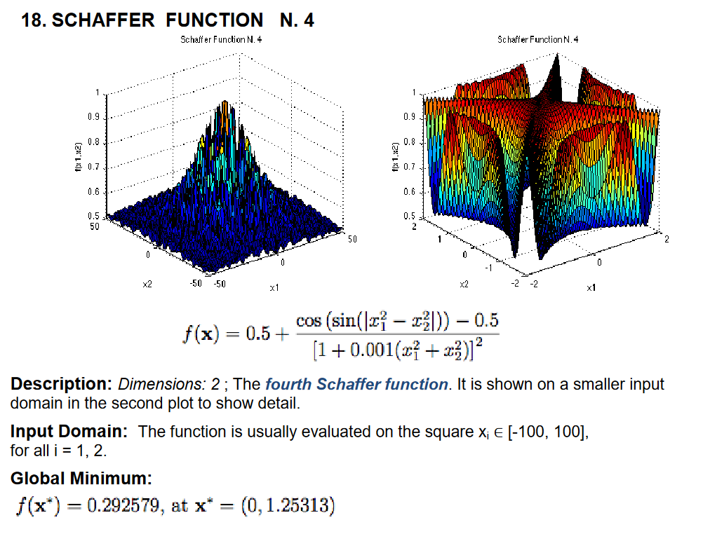

# Evolution Algorithm

In computational intelligence (CI), an evolutionary algorithm (EA) is a subset of evolutionary computation, a generic population-based metaheuristic optimization algorithm. An EA uses mechanisms inspired by biological evolution, such as reproduction, mutation, recombination, and selection. Candidate solutions to the optimization problem play the role of individuals in a population, and the fitness function determines the quality of the solutions. Evolution of the population then takes place after the repeated application of the above operators.

For full description, see [wikipedia](https://en.wikipedia.org/wiki/Evolutionary_algorithm)

# Implementation

The following is an example of a generic single-objective genetic algorithm.

Step One: Generate the initial population of individuals randomly. (First generation)

Step Two: Repeat the following regenerational steps until termination:

1. Evaluate the fitness of each individual in the population (time limit, sufficient fitness achieved, etc.)
2. Select the fittest individuals for reproduction. (Parents)
3. Breed new individuals through crossover and mutation operations to give birth to offspring.
4. Replace the least-fit individuals of the population with new individuals.

# Problem - Schaffer Function N. 4

